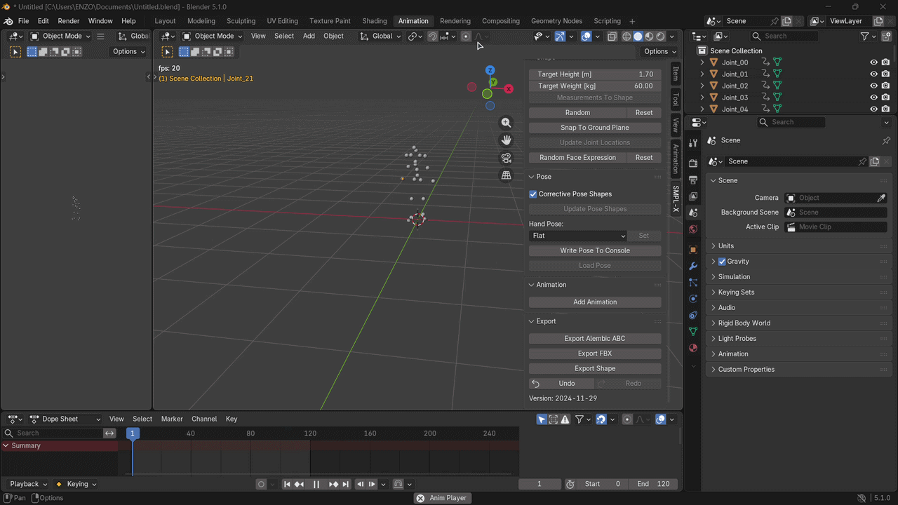
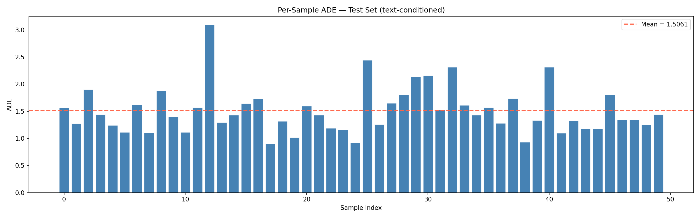
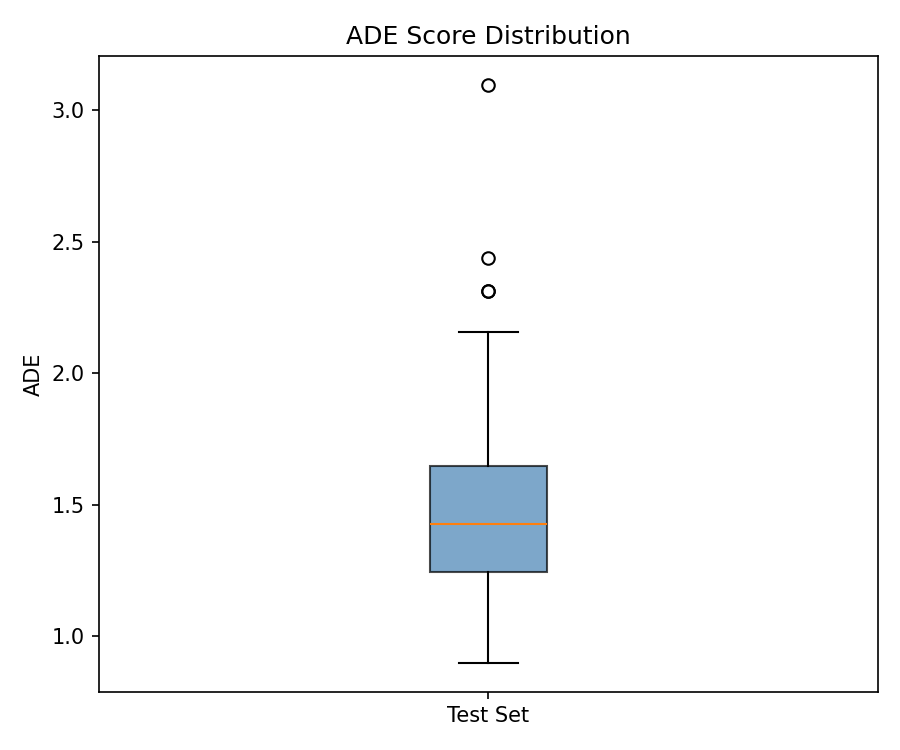
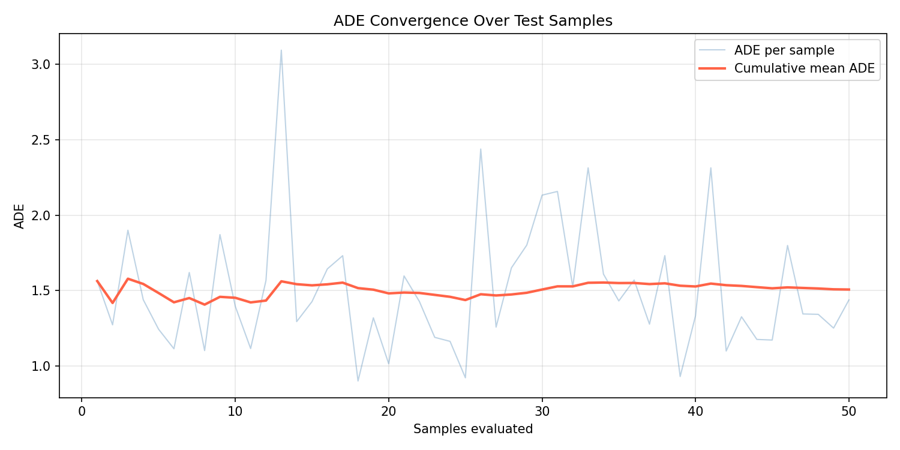

***

# MotionGen-AI Diffusion Model - Full Implementation Guide


## 1. The Mandatory File Setup (Do This First)
The code will crash unless these files are manually placed in your project root. Do not rely on scripts; verify these exist:

### **A. SMPL Body Models (The "Geometry" Fix)**
You must have the SMPL neutral model. Without it, the `rot2xyz` transformation (converting rotations to 3D points) will fail.
* **Path:** `body_models/smpl/SMPL_NEUTRAL.pkl`
* **Where to get it:** Download from the [SMPL website](https://smpl.is.tue.mpg.de/) (requires account) or copy from your previous research drive.

### **B. T2M Evaluator (The "Referee" Fix)**
This is required to calculate ADE/FDE and FID scores.
* **Path:** `t2m/text_mot_match/model/finest.tar`
* **Status:** This folder **must** be in your root. If it is missing, the evaluator cannot "judge" your motion.

### **C. GloVe Text Embeddings**
* **Path:** `glove/glove.6B.300d.txt`
* **Note:** If you only have the `.zip` or `.gz`, you **must** extract it so the raw `.txt` is visible.

---

## 2. The "Clean" Environment Setup
To stop the **NumPy 2.0 / Chumpy** errors, run this exact block at the top of your notebook or as a script. It "tricks" the old libraries into working with new Python versions.

```python
import numpy as np
import os

# LEGACY PATCH: Fixes 'ImportError: cannot import name float_ from numpy'
def patch_numpy():
    for attr in ['float', 'int', 'bool', 'complex', 'object', 'float_', 'int_']:
        if not hasattr(np, attr):
            setattr(np, attr, float if 'float' in attr else int if 'int' in attr else bool)
    print("NumPy Legacy Patch Applied.")

patch_numpy()

# Stop ALSA/Audio errors on headless servers
os.environ['SDL_VIDEODRIVER'] = 'dummy'
```

---

## 3. Local Training & Evaluation
Use these commands in your terminal. We use `TensorboardPlatform` to ensure your logs are saved locally as `.tfevents` files for plotting.

### **Training**
```powershell
python -m train.train_mdm --save_dir save/run_v15 --dataset humanml --batch_size 32 --train_platform_type TensorboardPlatform --overwrite
```
---

### **Evaluation**

For practice, I implemented an ADE (Average Displacement Error) based evaluation script to measure how close generated motions are to ground truth joint positions. While ADE is not the standard metric used in the MDM paper (which uses FID, R-Precision, and Diversity via a pretrained T2M motion encoder), it serves as a simple and interpretable sanity check for tracking model improvement across training checkpoints without requiring additional pretrained evaluator models.

Results at step 45k (7.5% of full training, text-conditioned, guidance=2.5):
- Mean ADE: 1.19 (unconditioned) / 1.51 (text + CFG)
- Evaluated on 50 HumanML3D test sequences

> Note: ADE penalizes semantically correct but geometrically different motions, so lower ADE does not strictly mean better generation quality. A fully trained MDM on the complete dataset would be evaluated with FID/R-Precision for meaningful comparison against published results.

---

### **Evaluation (Calculating ADE)**
```powershell
python evaluate_mdm.py --model_path model\mode0000000000.pt --args_path  model\args.json --device cuda
```

---

## 4. The Matplotlib Visualizer
Run this Python code to see your progress without needing an internet connection or WandB.

```python
import matplotlib.pyplot as plt
from tensorboard.backend.event_processing.event_accumulator import EventAccumulator
import glob

# Finds the most recent log in your save folder
event_file = glob.glob("save/run_v15/events.out.tfevents.*")[-1]
ea = EventAccumulator(event_file)
ea.Reload()

# Plot Loss
steps = [x.step for x in ea.Scalars('loss')]
values = [x.value for x in ea.Scalars('loss')]

plt.figure(figsize=(10, 5))
plt.plot(steps, values, color='blue', label='Diffusion Loss')
plt.title('Training Progress: Loss vs Steps')
plt.xlabel('Steps'); plt.ylabel('MSE'); plt.legend()
plt.savefig('docs/loss_plot.png')
plt.show()
```

---

## 5. Blender Visualization Code
*To see your model's motion in 3D, open Blender's Scripting tab and paste blender.py content and add path to result npy file.*
---
## Demo
text prompt : "a person walking forward"


---

## ADE



---

## Credits & Citations

This project is built upon the incredible work of the 3D motion research community. If you use this code or the pre-trained models, please cite the following:

### **1. Motion Diffusion Model (MDM)**
The core architecture and training logic are based on the MDM paper.
* **Paper:** [Human Motion Diffusion Model](https://arxiv.org/abs/2209.14916)
* **Authors:** Guy Tevet, Sigal Raab, Brian Chen, Yun Liu, Amit H. Bermano, Daniel Cohen-Or.
* **Repo:** [GuyTevet/motion-diffusion-model](https://github.com/GuyTevet/motion-diffusion-model)

### **2. HumanML3D Dataset**
The primary dataset used for text-to-motion mapping.
* **Paper:** [Generating Diverse and Natural 3D Human Motions from Textual Descriptions](https://arxiv.org/abs/2207.13244)
* **Authors:** Guo, Chuan and Zou, Shihao and Zuo, Xinxing and Wang, Sen and Ji, Wei and Li, Xingyuan and Cheng, Li.
* **Repo:** [EricGuo5513/HumanML3D](https://github.com/EricGuo5513/HumanML3D)

### **3. SMPL Body Model**
Used for the `rot2xyz` transformation and skeleton visualization.
* **Paper:** [SMPL: A Skinned Multi-Person Linear Model](https://smpl.is.tue.mpg.de/)
* **Organization:** Max Planck Institute for Intelligent Systems.

### **4. Text Embeddings (GloVe & CLIP)**
* **GloVe:** [Stanford NLP](https://nlp.stanford.edu/projects/glove/)
* **CLIP:** [OpenAI CLIP](https://github.com/openai/CLIP)

---
